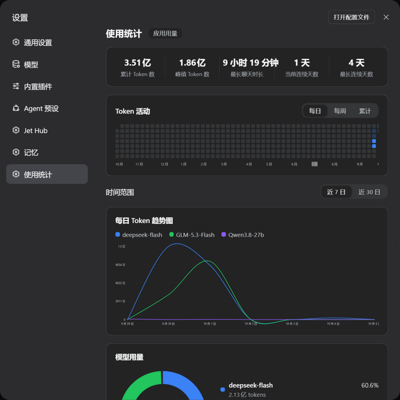

# dsh-usage-stats — ZCode 风格使用统计（DSH 插件）

把 ZCode 的「使用统计 / 应用用量」页移植成 DeepSeek Harness（DSH）的 cordis 插件：
从本地会话日志聚合 Token 用量，提供指标卡、活动热力图、每日趋势、模型用量环形图。



## 功能

- **5 指标卡**：累计 Token 数 / 峰值 Token 数 / 最长聊天时长 / 当前连续天数 / 最长连续天数
- **Token 活动热力图**：GitHub 风格年视图，每日 / 每周 / 累计三种模式
- **每日 Token 趋势图**：近 7 日 / 近 30 日，多模型平滑曲线 + 悬浮分模型明细
- **模型用量环形图**：占比 + 数量图例
- 设置页独立「使用统计」分区，右下角刷新

## 数据来源与聚合

- 扫描 `~/.dsh/sessions/<cwd>/session-<id>/session.v4.jsonl.zstd`
- 该文件是**多帧 zstd 拼接**（每次写入追加一帧），Node 的 `zstdDecompressSync` 只解第一帧，插件按帧魔数 `28 B5 2F FD` 切片逐帧解压
- `request/header` 事件 → 当前模型路由；`assistant/message` 事件的 `data.usage.totalTokens` → 记到该模型、按事件时间落日
- 聊天时长按**活跃时长**计：相邻事件间隔超过 10 分钟按 10 分钟封顶，挂机跨天不虚增
- 增量缓存 `~/.dsh/usage-stats/cache.json`（按文件 mtime+size 签名，v2 结构）

## 安装

```powershell
git clone https://github.com/One1turn/dsh-usage-stats.git
& "$env:LOCALAPPDATA\Programs\DeepSeek Harness\1\resources\runtime\cli\bin\dsh.cmd" plugin --profile desktop add -w link:<克隆路径>
```

（或下载 Release zip 解压后同样 link；或在会话里让 Agent 用 `plugin_manager` → `install_bundle`。）

装完**重启 DSH**，设置页出现「使用统计」分区。

## 配置（cordis.patch.yml 的 `usage-stats` 条目 config 节）

```yaml
- id: usage-stats
  name: '@local/dsh-usage-stats'
  config:
    sessionsRoot: ""   # 留空=~/.dsh/sessions
    cacheFile: ""      # 留空=~/.dsh/usage-stats/cache.json
```

## 已知边界

- 只统计落盘会话日志里有 provider usage 的请求；未上报用量的请求不计
- 模型名为会话日志中的原始路由名（provider 侧拼写）
- 设置导航的小图标由宿主按分区 id 写死，插件侧无法自定义
- 零 `@deepseek-ai/*` 裸导入（外部 link 插件解析不到宿主 SDK），全部走 ctx 服务 + node 内置
